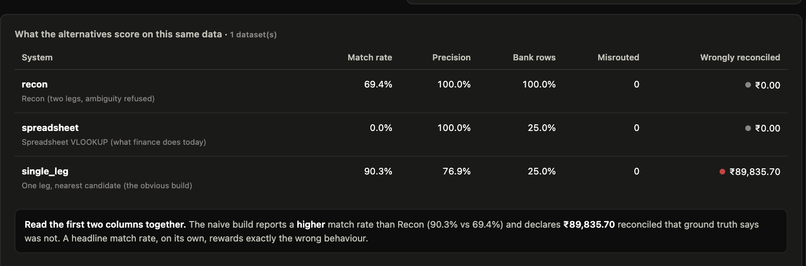
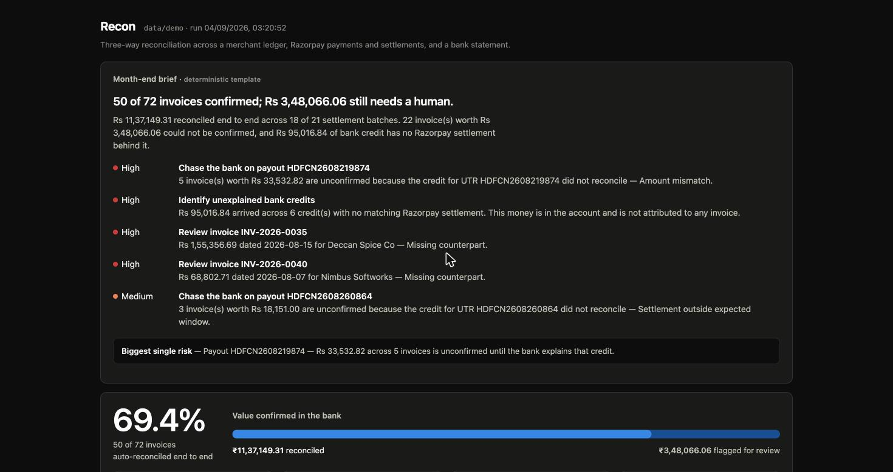

# Recon

An AI reconciliation agent for Razorpay merchants. It matches a merchant's own
ledger against Razorpay's payments and settlement recon report and against their
bank statement, auto-resolves what it can prove, and produces an honest exception
list for everything it cannot — with a plain-English note on every flagged row and
an append-only audit trail behind every decision.

Built for the **Razorpay Buildathon, Track 04 — AI Finance Controller**
(multi-source reconciliation).

---

## The problem, in one paragraph

A merchant has three records of the same money and they never line up. Their
ledger says an invoice went out for ₹2,500 on the 3rd. Razorpay says it captured
₹2,500, took a 2% fee plus 18% GST on that fee, and paid out the remainder. The
bank says ₹32,196.70 landed on the 5th under UTR `HDFCN2608219874`. None of those
numbers equal each other, and the bank credit covers **five invoices at once** —
Razorpay batches a day of payments into one payout. So there is no row-to-row
match to find. That is why this is done by hand.

---

## What it does

**Two legs, because the merchant's real question is not "does this row match a
row" — it's "is the money for this invoice actually in my bank account".**

```
Leg A   ledger invoice  ──▶  Razorpay payment      did we capture it?
Leg B   settlement UTR  ──▶  bank credit           did they pay us out?
```

An invoice is reconciled only when both legs hold. Leg B is many-to-one by nature:
payments are grouped by the UTR the recon report says paid them out, the group's
expected credit is the sum of the recomputed nets, and that single number is
matched against the bank.

**Leg A runs as three global passes, not row by row.** Every reference match is
settled before any amount-based guess is allowed, so a strong match can never lose
its payment to a weaker one evaluated first. Each payment can be claimed exactly once.

| Pass | Rule | Confidence |
|---|---|---|
| A1 | gateway reference (`order_ref` ↔ `order_id`) | 1.00 |
| A2 | exact amount, date inside the window, exactly one candidate | 0.92 |
| A3 | amount within rounding tolerance, exactly one candidate | 0.78 |
| B1 | UTR group's net total equals the bank credit exactly | 1.00 |
| B2 | equal within batch tolerance | 0.80 |
| B3 | payout split across tranches that sum to the total | 0.85 |

Anything left over becomes an exception with one of six reason codes:
`amount_mismatch`, `missing_counterpart`, `duplicate_utr`, `date_out_of_window`,
`ambiguous_candidates`, `unresolved`.

**The matching is deterministic and rule-based on purpose.** No model decides where
money went. A model that is 97% right about a settlement is 3% wrong about a bank
balance, and there is no way to audit which 3%.

---

## Where the AI is, and where it deliberately is not

```
     AI                      DETERMINISTIC                       AI
┌───────────┐          ┌──────────────────────┐         ┌────────────────┐
│  ingest   │  ──────▶ │   the money itself   │ ──────▶ │  explain · ask │
│           │          │                      │         │                │
│  map any  │          │  two legs, six rules │         │  exception     │
│  bank's   │          │  integer paise       │         │  notes, brief, │
│  CSV      │          │  reproducible        │         │  Q&A over the  │
│           │          │  no model, ever      │         │  result        │
└───────────┘          └──────────────────────┘         └────────────────┘
     ↑                            ↑                              ↑
 fuzzy, unbounded,        an equality test on         reading a decision
 obvious to a human       money — must be exact       out loud to a human
```

**AI at the edges, determinism at the core.** The three model-facing layers each sit
where the problem is genuinely open-ended, and none of them can move a rupee:

| Layer | What the model does | What it cannot do |
|---|---|---|
| **Ingest** (`npm run ingest`) | Maps an arbitrary bank/ledger CSV onto the internal schema, and decides whether `05/08/2026` is day-first | Nothing is mapped that is not a real column in the file; the mapping is written to `ingest.json` with a confidence and a reason per field before a single row is read |
| **Explain** (`npm run explain`) | Writes the note on each flagged row, plus a month-end brief over the whole run | The reason code, confidence and counterparts are already fixed. It rewrites; it does not decide. Every note is checked back against the facts it was given — see below |
| **Ask** (`npm run ask`, or the dashboard) | Answers questions by calling read-only tools over the finished run, and shows every call it made | Its entire tool surface is reads. There is no tool that matches, clears, re-runs or edits — asserted by a test, not by a prompt |

Every one of the three degrades to a deterministic path with no API key: an alias
table, sentence templates, and a disabled chat box. The reconciliation, the metrics
and the audit trail never need a model at all.

---

## Measured accuracy

Every number below is reproducible from the commands next to it. Nothing here is
hand-picked: the sweeps report the worst seed alongside the mean by construction.

### Held-out labelled batch — `--seed 424242`, never used to tune a threshold

```
npm run generate -- --seed 424242 --out data/holdout
npm run evaluate -- --data data/holdout
```

| Metric | Value |
|---|---|
| Records reconciled | 167 across 3 sources (72 invoices, 71 payments, 24 bank credits, 21 settlement batches) |
| Throughput | 68,860 records/sec (2.4 ms) |
| **Match rate** | **75.0%** — 54 of 72 invoices confirmed end to end |
| **Precision on auto-matched** | **100.0%** — 0 false positives, 0 misrouted |
| **Recall** | **100.0%** — 0 matchable invoices missed |
| Reason-code accuracy | 100.0% |
| Bank-row accuracy | 100.0% |
| ₹ auto-reconciled | ₹8,90,775.93 (88.0% of invoiced value) |
| ₹ flagged for review | ₹1,21,221.37 |
| ₹ unexplained bank credit | ₹51,705.81 |

Exceptions by reason: `amount_mismatch` 5 · `missing_counterpart` 4 ·
`duplicate_utr` 4 · `ambiguous_candidates` 4 · `date_out_of_window` 1.

### 40 unseen seeds per profile

```
npm run sweep -- --seeds 40 --profile standard
npm run sweep -- --seeds 40 --profile hard
```

| Profile | Match rate | Precision (min) | Recall (min) | Reason acc. | False pos. | Misroutes |
|---|---|---|---|---|---|---|
| standard | 75.7% | **100.0%** (98.2%) | 100.0% (98.2%) | 100.0% | 1 | **0** |
| hard | 55.6% | **100.0%** (100.0%) | 95.3% (75.6%) | 97.9% | **0** | **0** |

Roughly 2,900 invoices per profile, ~250k records/sec.

**Read the two rows together, because that is the actual claim.** Under adversarial
conditions the match rate nearly halves and recall drops to 95.3% — but precision
holds at 100% and not one invoice in ~5,800 was booked to the wrong payment.
The engine degrades by *declining to match*, not by guessing. Declining costs a
human five minutes; a false match is money silently booked to the wrong invoice
that nobody ever looks at again.

### Compared to what? — the two alternatives, scored on the same data

A precision number alone means nothing. Every design decision here — two legs,
global passes, refusing ambiguity, verifying the payout against the bank — costs
match rate, so the cost has to be measured against the things a merchant would
plausibly have instead. All three run in the same process, on the same datasets,
against the same ground truth.

```
npm run compare -- --seeds 40 --profile hard
```

**40 unseen seeds, hard profile (~2,900 invoices):**

| System | Match rate | Precision | Bank rows | Misrouted | **₹ wrongly declared reconciled** |
|---|---|---|---|---|---|
| **Recon** | 55.6% | **100.0%** | **100.0%** | **0** | **₹0.00** |
| Spreadsheet VLOOKUP | 0.0% | 100.0% † | 36.4% | 0 | ₹0.00 |
| One leg, nearest candidate | **74.6%** | 64.3% | 36.4% | 6 | **₹1,06,40,436.54** |

† Precision over an empty set. It matched nothing, so it got nothing wrong — which is
the clearest possible demonstration that precision without a match rate beside it is
not a result.

Two findings, and the second is the one that matters.

**The spreadsheet scores zero.** Not "poorly" — *zero*. Matching an invoice amount
against a bank statement never works, because Razorpay deducts a fee plus GST and
batches a day of payments into one credit. The invoice amount is not a number that
appears in the bank. That is the whole reason this problem is done by hand.

**The naive build scores better than Recon on the headline metric, and silently
books over a crore to the wrong place.** 74.6% versus 55.6% looks like a win. It is
produced by picking the nearest of several indistinguishable payments instead of
escalating, and by declaring an invoice reconciled without ever checking the payout
reached the bank. **A match rate, on its own, rewards exactly the wrong behaviour** —
which is why the metric this project optimises is precision, and why the exception
list is the product rather than an apology for it.



The same table renders on the dashboard from `compare.json`, so nothing in the video
is a claim the repo cannot reproduce.

### Why you should distrust the 100% on the standard profile

The generator and the matcher were written by the same hand, to the same spec. On
friendly data they agree with each other, and that measures implementation
correctness — not robustness to mess nobody anticipated. That is exactly why the
`hard` profile exists: it strips the gateway reference off 85% of ledger rows, lets
customers pay up to six days late (wider than the matcher's own default window, on
purpose), splits payouts across tranches, and multiplies every fault. The honest
headline is the hard-profile row, not the standard one.

### Threshold sensitivity — measured, not asserted

Sweeping the ledger date window across 40 hard-profile seeds, with calibration
switched off so the setting under test is the one actually in effect:

```
for w in 2 3 4 5 6 7; do
  npm run sweep -- --seeds 40 --profile hard --no-calibrate --ledger-window-max $w
done
```

| Window (days) | Match rate | Precision | Recall | Misroutes |
|---|---|---|---|---|
| 2 | 46.4% | 99.9% | 79.6% | 1 |
| 3 *(configured default)* | 49.8% | 99.9% | 85.5% | 1 |
| 4 | 52.9% | 99.9% | 90.8% | 1 |
| 5 | 55.5% | **100.0%** | 95.3% | **0** |
| 6 | 58.3% | **100.0%** | 100.0% | **0** |
| 7 | 58.3% | 100.0% | 100.0% | 0 |

**Precision improves as the window widens**, which is the opposite of the intuition
that a tighter window is safer. A window too narrow to contain the true payment does
not decline to match — it leaves some coincidental payment as the only candidate in
range and matches *that*. Widening the window brings the real payment back in, the
row becomes ambiguous, and an ambiguous row is reported rather than guessed.
Narrowness was hiding the ambiguity that would have caught the error.

That finding is why the engine **calibrates the window from the data** rather than
hard-coding it. Every A1 reference match is a pair already known to be correct, so
each one is a free observation of how long this merchant's customers actually take to
pay; the window for the uncertain rows is measured from that. Same 40 seeds, same
configured default of 3 days:

| | Match rate | Precision | Recall | Misroutes |
|---|---|---|---|---|
| calibration off | 49.8% | 99.9% | 85.5% | 1 |
| **calibration on** *(default)* | **55.6%** | **100.0%** | **95.3%** | **0** |

Calibration lands on the same numbers as a window hand-tuned to 5 days — without
being told what the lag was.

---

## Quick start

Node 22 or newer. No credentials needed for any of this.

```bash
npm install
npm run demo          # the whole story in one command — generate, reconcile,
                      # explain, verify, score, compare
npm run serve         # then the dashboard at http://localhost:8787
```



Or step by step:

```bash

npm run generate -- --seed 7   --out data/demo              # synthetic merchant-month + ground truth
npm run reconcile -- --data data/demo                       # match; writes result.json + audit.jsonl
npm run explain   -- --data data/demo                       # note on every exception + month-end brief
npm run serve                                               # dashboard at http://localhost:8787

npm test                                                    # 107 tests
npm run verify   -- --data data/demo                        # check the run against its own claims
npm run evaluate -- --data data/demo                        # score against ground truth
npm run compare  -- --data data/demo                        # vs the two alternatives
npm run sweep    -- --seeds 40 --profile hard               # 40 unseen seeds
```

### Verifying a run, rather than trusting it

```
$ npm run verify -- --data data/holdout

  PASS  determinism                                    two independent runs hash to 845e93903146869f
  PASS  every invoice reaches the audit trail          179 entries for 72 invoices
  PASS  every audit line is valid JSON                 179/179 lines parsed
  PASS  audit sequences are dense (no line removed)    1 run(s), all sequential
  PASS  every rupee is in exactly one bucket           matched 8,90,775.93 + flagged 1,21,221.37 = invoiced 10,11,997.30
  PASS  matched + flagged equals the invoice count     54 + 18 = 72
  PASS  no record is in an undefined state             72 invoices, 2 possible states
  PASS  every flagged record carries a known reason code   18 flagged, all coded
  PASS  no payment is claimed by two invoices          54 payments, each claimed once
  PASS  nothing auto-matched contradicts ground truth  54 auto-matched, all correct

  10/10 checks passed
```

"Append-only audit trail" is only a claim until removing a line is detectable.
Delete one from the middle and the verifier fails the run and names the position:

```
  FAIL  audit sequences are dense (no line removed)    run_1788471324022 jumps to 42 at position 41
```

Both behaviours are tested by spawning the real CLI over real files
(`server/test/verify.test.js`), so the check cannot quietly stop working.

With `ANTHROPIC_API_KEY` set, `explain` and the dashboard's chat panel come alive, and:

```bash
npm run ask -- --data data/demo "how much money is stuck, and who do I chase first?"
npm run ask -- --data data/demo                             # interactive
```

### Running against real Razorpay data

```bash
cp .env.example .env      # add RAZORPAY_KEY_ID / RAZORPAY_KEY_SECRET (test mode)
npm run pull -- --from 2026-08-01 --to 2026-08-31 --out data/live
npm run reconcile -- --data data/live
```

`pull` fetches real captured payments and settlement recon rows, then builds the
merchant ledger and bank statement around them so the identical pipeline runs. It
**refuses to run against a live key** — a live key here would pull real customer
payment data into a hackathon repo.

**One thing to know up front:** Razorpay test mode does not run a real settlement
cycle, so `settlements.reports()` is usually empty even with plenty of test
payments. When that happens Recon derives the payout schedule locally using
Razorpay's real T+2 batching rule, prefixes those UTRs with `DERIVED` so nobody
mistakes them for the gateway's, and sets `manifest.derived_settlements: true`. The
payments are real; the UTRs in that case are not, and the artefacts say so.

### Running against someone else's CSV

Every bank exports a different file. HDFC writes `Narration` and `Deposit Amt.`,
ICICI writes `Transaction Remarks` and `Deposit Amount(INR )`, Axis writes
`PARTICULARS` and one `AMOUNT` column with a separate `DR|CR` flag. There is no
standard, which makes column mapping the exact shape a model is good at and a rule
table is not.

```bash
npm run ingest -- --bank ~/Downloads/statement.csv --ledger ~/Downloads/tally.csv --out data/live
npm run pull   -- --from 2026-08-01 --to 2026-08-31 --out data/live
npm run reconcile -- --data data/live
```

It prints the mapping it chose, with a confidence and a reason per field, then
writes canonical CSVs plus `ingest.json`. A deterministic alias table runs first and
resolves most real files with no model at all; the model reviews that proposal
rather than starting cold. A column the model invents is discarded with a warning,
one source column can never feed two fields, and a required field it cannot resolve
aborts the ingest instead of guessing.

The date format is inferred from the whole column, not one cell: a value with a
first component above 12 proves day-first. When the column proves nothing, the run
says `INFERRED, not proven` rather than quietly picking. **A date read the wrong way
round does not throw — it shifts every credit by up to eleven days and turns
correct matches into `date_out_of_window` exceptions.**

Verified end to end: the committed demo month, re-exported in HDFC's format and in
Axis's single-amount-column format, reconciles to a byte-identical summary
(`server/test/ingest.test.js`).

### Exception notes, the brief, and the ask agent

`npm run explain` writes one note per exception plus a month-end brief over the whole
run. With `ANTHROPIC_API_KEY` set it uses Claude (`claude-opus-5`, structured output,
shared system prompt cached ahead of the per-exception facts). Without a key — or on a
refusal, a rate limit, or any other failure — it falls back to deterministic templates
carrying the same facts. The report is never blank, and the audit trail records which
path wrote each note.

The **ask agent** answers questions against a finished run through seven read-only
tools (`reconciliation_summary`, `search_exceptions`, `get_invoice`,
`get_settlement_batch`, `list_settlement_batches`, `aggregate_exceptions`,
`search_audit`). It ships the trace of every tool call it made alongside the answer,
because an answer a model wrote about money is only worth the records it is provably
built from.

### "How do you know it isn't making the numbers up?"

Every note the model writes is parsed and checked back against the exact fact pack
it was given, before it reaches the report. Two classes of claim, deliberately
treated differently:

**An invented record is rejected outright.** An invoice id, UTR, payment id or bank
transaction id that does not appear in the facts is pure invention — there is no
legitimate reason to write one — so the note is discarded and the deterministic
template used instead. The audit trail records why:

```
fallback_reason: "note referenced records not in the facts: INV-2026-7777, ICICN0000000001"
```

**An unverifiable amount is flagged, not suppressed.** A rupee figure not present in
the facts is usually the model deriving a shortfall it was asked not to compute. That
is worth surfacing, but it is not necessarily wrong, and discarding a good note over
it would trade a small risk for a certain loss of clarity. It is recorded on the note,
in the audit trail, and in the run summary:

```
grounding: 24 model note(s) checked against their own facts, 0 rejected for naming
records that were never supplied, 1 contains a figure not in the facts (545.00)
```

Tested both ways in `server/test/explainer.test.js`, including that a fabricated
invoice id never survives to the output and that ordinary finance words like GST,
NEFT and UTR are not mistaken for invented references.

### What a run costs

A finance tool that costs more than the person it replaces is a demo, not a product,
so `npm run explain` prices itself and prints the comparison:

```
  cost: $<measured> for 24 exception(s) — $<measured> each
  the same review by hand: ~36 minutes, about $3.60 of analyst time
  <N>x faster, and it never gets bored on row 40
  prompt caching saved $<measured> on this batch alone
```

**The machine figures are computed from the token counts the API actually reported
for that run — nothing is estimated, and no number is printed until a real call has
been made.** A run that went through the deterministic templates prints `$0.00` and
says why. Rates are the published list prices, kept in one place in
`server/src/explain/cost.js` alongside the assumption behind the human column: 90
seconds per exception at $6/hour, which is generous to the human — it assumes they
already have all three systems open and know what they are looking at.

The right-hand side is the fixed one: **24 exceptions is about 36 minutes of analyst
time, every month, forever.** Whether the left-hand side reads $0.10 or $0.30 does not
change the argument.

---

## What's in the box

```
server/src/
  generate/    synthetic merchant-month + injected faults + ground truth
  ingest/      AI column mapping for foreign CSVs + alias table + date inference
  sources/     Razorpay client, CSV/JSON loaders, normalisation
  match/       the engine — two legs, three passes, six reason codes
  explain/     Claude exception notes + month-end brief + cost accounting
  agent/       read-only tools and the ask loop
  eval/        scoring against ground truth, and the two baselines
  cli/         demo · generate · pull · ingest · reconcile · explain · ask
               verify · evaluate · compare · sweep
web/           single-file dashboard, no build step
metrics/       committed evidence for every number in this README
docs/          architecture, thresholds, limitations
```

---

## Deliberate decisions

**All money is integer paise, never a float.** Reconciliation is an equality test on
money; floats make equality a lie (`0.1 + 0.2 !== 0.3`), inventing amount mismatches
that don't exist and hiding real ones in rounding noise. Razorpay's API speaks paise
natively, so this is also the native unit.

**A reference match with a wrong amount is an `amount_mismatch`, not "unmatched".**
The row is positively identified; only the number is wrong. Collapsing those two
into one bucket is how real recon reports become useless.

**Ambiguity is reported, never resolved by picking the nearest.** Two invoices with
the same amount on the same day and no gateway reference are genuinely
indistinguishable. Guessing there is what produces a confident, wrong reconciliation.

**Unexplained money is an exception too.** A bank credit with a UTR Razorpay never
issued gets flagged. A reconciliation that only looks for what it expects will
happily miss cash it cannot account for.

**A split payout is not a duplicate.** Two credits under one UTR that sum to the
payout are normal Razorpay behaviour; a sum that overshoots is a real double-post.
The sum is what disambiguates them.

**The agent's read-only-ness is structural, not instructed.** There is no tool that
writes, so "the model must not clear an exception" is not a rule it could talk its
way past. A test calls every tool and asserts the result is byte-identical
afterwards; another asserts the declared tool list and the implemented one are the
same set, so a write tool cannot be added quietly.

**A file already in our own vocabulary never reaches the mapper.** The committed
datasets take a native path with no model call, so the pipeline that produced the
published metrics stays deterministic end to end.

**The baselines are scored, not described.** It would have been easy to assert that a
naive matcher is worse. Running it on the same data instead turned an opinion into a
₹1.06 crore number — and revealed the more useful finding, that the naive build wins
on the metric most people would report.

### Departures from the original brief

- **JSONL audit trail, not Supabase/Postgres.** The audit log is append-only by
  construction — every run appends, nothing rewrites an earlier line, sequence
  numbers are dense so a removed line is detectable. That property is what makes it
  evidence. A database adds a network dependency to a demo without adding it.
- **A meter, not a donut.** Matched-vs-flagged is a single ratio, and a two-slice pie
  is the wrong form for that shape. The meter reads the proportion faster.
- **One static HTML file, not a React build.** No build step, no CDN, no `dist/`
  to go stale — it renders the exact artefacts the CLI wrote.

---

## Known limitations

Stated plainly, because a reconciliation tool that oversells itself is worse than one
that doesn't exist.

1. **The live Claude paths are unexercised.** No Anthropic credentials were available
   on the machine this was built on, so all three model layers — ingest mapping,
   exception notes and brief, and the ask agent — have only ever run through their
   deterministic fallbacks or against stubbed clients in the test suite. The request
   shapes are written against the current SDK and the plumbing around them is tested,
   but no real call has been made. Run `npm run explain` and `npm run ask` once with a
   key before demoing either.
2. **The standard-profile accuracy numbers grade their own homework** (see above).
   Trust the hard-profile row.
3. **Refunds, chargebacks and partial captures are not modelled.** Only inbound
   settlement credits are reconciled; bank debits are filtered out.
4. **Multi-currency is out of scope.** Everything assumes INR.
5. **The live path injects no amount/date collisions**, because real payment amounts
   can't be forced to collide. The synthetic profiles cover that case.
6. **Calibration needs ≥ 8 reference matches** to fire; below that it falls back to the
   configured default window. A merchant who never passes `order_id` gets the default.
7. **The ingest layer maps columns and parses dates. It does not clean rows.** A
   statement with merged header rows, mid-file subtotals, or a page footer repeated
   every 40 lines will map correctly and then feed junk rows through. Strip those first.
8. **The ask agent is not evaluated for answer quality.** Its tools are tested, its
   loop is tested, and it is structurally incapable of writing — but there is no scored
   benchmark of whether its prose is right, the way there is for the matcher. Treat its
   answers as a faster way to read the exception list, not as a second opinion on it.

---

## Docs

- [`docs/ARCHITECTURE.md`](docs/ARCHITECTURE.md) — data flow, the matching algorithm
  in detail, every threshold and why it has the value it has.
- [`metrics/`](metrics/) — the raw JSON behind every number above.
